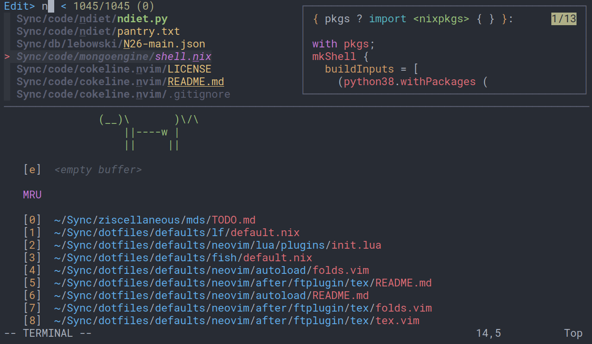
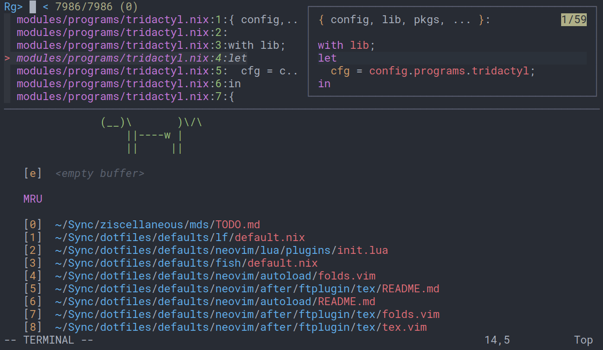

The `init.vim` file contains two functions, `s:fuzzy_edit` and
`s:fuzzy_ripgrep`, meant to replace the default `:FZF` and `:Rg` commands from
[fzf.vim](https://github.com/junegunn/fzf.vim).

The main advantage they have over the default implementations is the ability to
define custom sinks, i.e. what happens after you select one or more files. For
example, the default `:Rg` command opens the first selected file in a new
buffer and adds all the remaining ones to the quickfix list, and there's not
really a way to customize that.

By default `fuzzy_ripgrep` opens the first file in a new buffer and adds all
the remaining ones to the buffer list, but customizing this behavior is as easy
as changing `init.vim`'s
[L14-L16](https://github.com/noib3/dotfiles/blob/master/defaults/neovim/lua/plugins/config/fzf/init.vim#L14-L16).

For example, to open the first file in a vertical split adding all the
others to the buffer list
[L14](https://github.com/noib3/dotfiles/blob/master/defaults/neovim/lua/plugins/config/fzf/init.vim#L14)
can be changed to:
```vim
" init.vim, line 14
execute 'vsplit '.remove(s:files, 0)
```
or to open all selected files in new horizontal splits
```vim
" init.vim, lines 14-16
execute 'split '.remove(s:files, 0)
call cursor(s:lnum, s:col)
for file in s:files | execute 'split '.file | endfor
```
and so on.

`fuzzy_ripgrep` differs from the default `:Rg` command in two other ways:

* `Rg` calls ripgrep only once with the initial search (e.g. `:Rg foo`) and fzf
  then filters the output. On the other hand, `fuzzy_edit` executes ripgrep
  every time the query string is changed, using fzf solely as a selector
  interface;
* `Rg` uses (neo)vim's current working directory as the base directory for
  the ripgrep's search. `fuzzy_edit` uses the cwd as the base directory only if
  it is not contained in a git repo. If it is, it will use the repo's root
  directory instead. This is really convenient when editing files buried
  deeply inside a repository, where a simple `:Rg` search would return few
  to no results.

Finally, the `init.lua` file contains just some layout customization options
for the fzf popup terminal window.

All in all, when they are in use they look like this:

|  |
|:--:|
| `fuzzy_edit()` |
|  |
| `fuzzy_ripgrep()` |
